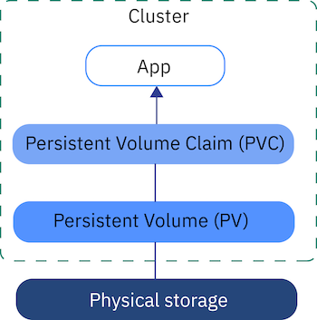

# k8s-wp
Simple two-tier application using WordPress and MySQL on Kubernetes. The goal of this
challenge is to touch upon the following concepts:

- PODs, ReplicaSets, Deployments
- Services
- Secrets
- Environment Variables
- Persistent Volumes and Persistent Volume Claims

Inspired by [Mumshad's](https://github.com/mmumshad) [Kubernetes Hands On Challenge](https://github.com/kodekloudhub/kubernetes-challenge-1-wordpress).


# Deploy

The simplest way to deploy the WP app is to use the `make` command:

```bash
$ make deploy
```

If you want to clean up just do:

```bash
$ make destroy
```

# Use Shortcuts/Aliases

- `po` for PODs
- `rs` for ReplicaSets
- `deploy` for Deployments
- `svc` for Services
- `ns` for Namespaces
- `netpol` for Network policies
- `pv` for Persistent Volumes
- `pvc` for PersistentVolumeClaims
- `sa` for service accounts

Even better is to have your own aliases. Check out this repo for some ideas: https://github.com/ahmetb/kubectl-aliases

So instead of doing
```bash
kubectl get pods
```
you can do
```bash
k exec get po
```

which is a bit faster :)


# Chapters we've covered

These are chapters you need to read to understand how this application works. These
are also chapters required for
[Certified Kubernetes Administrator (CKA) Program](https://www.cncf.io/certification/cka/).

1. [Commands and Arguments](#commands-and-arguments)
1. [Environment Variables](#environment-variables)
1. [Config Maps](#config-maps)
1. [Secrets](#secrets)
1. [Security Context](#security-context)
1. [Service Account](#service-account)
1. [Resource Limits](#resource-limits)
1. [Multi-Container PODs](#multi-container-pods)
1. [Liveness and Readiness Probes](#liveness-and-readiness-probes)
1. [Container Logging](#container-logging)
1. [Monitoring and Debugging](#monitoring-and-debugging)
1. [Labels and Selectors](#labels-and-selectors)
1. [Rolling updates and Rollbacks in Deployment](#rolling-updates-and-rollbacks-in-deployment)
1. [Jobs and Cronjobs](#jobs-and-cronjobs)
1. [Network Policy](#network-policy)
1. [State Persistence](#state-persistence)
1. [Troubleshooting](#troubleshooting)

## Commands and Arguments

Containers are meant to run a specific task or process (e.g. Web Server, or Application
Server or a database or simply to carry out some kind of computation or analysis). Once
the task is complete the container exits. A container only lives as long as the process
inside it is alive. If the web service inside the container is stopped or crashes the
container exits.

So who defines what process is run within the container? In `Dockerfile` we have the
`CMD` and `ENTRYPOINT` commands.

Example:

```
FROM ubuntu

ENTRYPOINT ["sleep"]

CMD ["5"]
```

In Kubernetes we have `command` and `args` keys:

```
apiVersion: v1
kind: Pod
metadata:
  name: ubuntu-sleeper-pod
spec:
  container:
    name: ubuntu
    image: ubuntu
    command: ["sleep"]
    args: ["5"]
```

k8s `command` is the same as the Docker's `ENTRYPOINT` and the `args` is equivalent
to the `CMD`.
Also k8s will overwrite docker commands and arguments.


See: [Commands and Arguments](https://kubernetes.io/docs/tasks/inject-data-application/define-command-argument-container/)

## Environment Variables

We have 3 environ value types:
1. Plain key value
1. ConfigMap
1. Secrets


```
env:
  - name: APP_COLOR
    value: ping

env:
  - name: APP_COLOR
    valueFrom:
      configMapRef:

env:
  - name: APP_COLOR
    value:
      secretKeyRef:
```

See: [Environment Variables](https://kubernetes.io/docs/tasks/inject-data-application/define-environment-variable-container/)

## Config Maps

ConfigMaps are used to pass configuration data in the form of key value pairs in
Kubernetes.
There are two phases involved in configuring ConfigMaps. First create the ConfigMaps
and second Inject them into the POD.

configmap.yaml:

```
apiVersion: v1
kind: ConfigMap
metadata:
  name: color-config
data:
  APP_COLOR: blue
  APP_MODE: prod
```

pod.yaml:

```
apiVersion: v1
kind: Pod
metadata:
  name: simple-webapp-color
spec:
  containers:
    - name: simple-webapp-color
      image: simple-webapp-color
      ports:
        - containerPort: 8080
      envFrom:
        - configMapRef:
          name: color-config
```

To see the configmaps type:

```bash
$ kubectl get configmaps
$ kubectl describe configmaps
```

See:
- [Config Maps](https://kubernetes.io/docs/tasks/configure-pod-container/configure-pod-configmap/)
- [Configuring Redis using a ConfigMap](https://kubernetes.io/docs/tutorials/configuration/)

## Secrets

Secrets are used to store sensitive information, like passwords or keys. They are
similar to `configMaps`, except that they are stored in an encoded or hashed format. As
with `configMaps`, there are two steps involved in working with Secrets. First, create
the secret and second inject it into Pod.


secret.yaml:

```
apiVersion: v1
kind: Secret
metadata:
  name: color-secret
data:
  DB_Host: bXlzcWw=  # echo -n 'mysql' | base64
  DB_User: cm9vdA==  # echo -n 'root' | base64
  DB_Password: cGFzc3dvcmQ=  # echo -n 'password' | base64
```

pod.yaml:

```
apiVersion: v1
kind: Pod
metadata:
  name: simple-webapp-color
spec:
  containers:
    - name: simple-webapp-color
      image: simple-webapp-color
      ports:
        - containerPort: 8080
      envFrom:
        - secretRef:
          name: color-secret
```


```bash
$ kubectl get secrets
$ kubectl describe secrets
```

If you were to mount the secret as a volume in the Pod, each attribute in the secret is
created as a file with the value of the secret as its content.

See:
- [Secrets](https://kubernetes.io/docs/concepts/configuration/secret/)
- [Distribute Credentials Securely Using Secrets](https://kubernetes.io/docs/tasks/inject-data-application/distribute-credentials-secure/)

## Security Context

By default Docker runs a container with a limited set of capabilities. And so the
processes running within the container do not have the privileges to say, reboot the
host or perform operations that can disrupt the host or other containers running on
the same host. In case you wish to override this behavior and enable all privileges to
the container use the privileged flag.

I k8s you can configure the security settings at a container or POD level. Example:

```
apiVersion: v1
kind: Pod
metadata:
  name: web-pod
spec:
  securityContext:
    runAsUser: 1000
  containers:
    - name: ubuntu
      image: ubuntu
      command: ["sleep", "3600"]
```

See:
- [Security Context](https://kubernetes.io/docs/tasks/configure-pod-container/security-context/)
- [Pod Security Policies](https://kubernetes.io/docs/concepts/policy/pod-security-policy/)
- [Security Best Practices for Kubernetes Deployment](https://kubernetes.io/blog/2016/08/security-best-practices-kubernetes-deployment/  )

## Service Account

There are two types of accounts in Kubernetes. A user account and a service account.
The user account is used by humans and service accounts are used by machines.

Service account object (service-account.yaml):
```
apiVersion: v1
kind: ServiceAccount
metadata:
  name: dashboard-sa
```

```bash
$ kubeclt create -f service-account.yaml
$ kubectl get serviceaccount
$ kubectl describe serviceaccount dashboard-sa
```

When the service account is created, it also creates a token automatically. The service
account token is what must be used by the external application while authenticating to
the Kubernetes API. The token, however, is stored as a secret object.

```bash
$ kubectl describe secret <secrets token>
```

If you want your pod to use a specific service account (e.g. `dashboard-sa` service
account) you need to specify this in the pod definition:

```
apiVersion: v1
kind: Pod
metadata:
  name: my-kubernetes-dashboard
spec:
  containers:
    - name: my-kubernetes-dashboard
      image: my-kubernetes-dashboard
    serviceAccount: dashboard-sa
```

Kubernetes automatically mounts the default service account if you haven’t explicitly
specified any.

See:
- [Service Account](https://kubernetes.io/docs/tasks/configure-pod-container/configure-service-account/)
- [Managing Service Accounts](https://kubernetes.io/docs/reference/access-authn-authz/service-accounts-admin/)

## Resource Limits

By default, kubernetes assumes that a POD or a container within a POD requires .5 CPU &
256 Mebibyte of memory.

By default Kubernetes sets a **limit** of 1vCPU and 512 Mebibyte on containers.


You can change this in the Pod spec. Example:

```
apiVersion: v1
kind: Pod
metadata:
  name: simple-webapp-color
  labels:
    name: simple-webapp-color
spec:
  containers:
    - name: simple-webapp-color
      image: simple-webapp-color
      ports:
        - containerPort: 8080
      resources:
        requests:
          memory: "1Gi"
          cpu: 1
        limit:
          memory: "2Gi"
          cpu: 2
```
If a POD exceeds resources kubernetes does the following:
- In case of the CPU, kubernetes throttles the CPU so that id does not go beyond the specified limit.
- In case of memory, the POD will be terminated.


See:
- [Configure Default Memory Requests and Limits for a Namespace](https://kubernetes.io/docs/tasks/administer-cluster/manage-resources/)
- [Assign Memory Resources to Containers and Pods](https://kubernetes.io/docs/tasks/configure-pod-container/assign-memory-resource/)
- [Resource Limits](https://kubernetes.io/docs/concepts/configuration/manage-compute-resources-container/)


## Multi-Container PODs

There are 3 common patterns, when it comes to designing multi-container PODs:

1. Sidecar
1. Adapter
1. Ambasador

See:
  - [Multi-Container PODs](https://kubernetes.io/docs/tasks/access-application-cluster/communicate-containers-same-pod-shared-volume/)
  - [Multi-Container Pod Design Patterns](https://matthewpalmer.net/kubernetes-app-developer/articles/multi-container-pod-design-patterns.html)

## Liveness and Readiness Probes

The POD status tells us were the POD is in its lifecycle. When a POD is first created, it
is in a Pending state. This is when the Scheduler tries to figure out were to place the
POD. If the scheduler cannot find a node to place the POD, it remains in a Pending
state.

Once the POD is scheduled, it goes into a ContainerCreating status, were the images
required for the application are pulled and the container starts. Once all the
containers in a POD starts, it goes into a running state, were it continues to be until
the program completes successfully or is terminated.

You can also see the Ready state of the POD, in the output of the `kubectl get pods`
command.

The ready conditions indicate that the application inside the POD is running and is
ready to accept user traffic. But sometimes the app needs some additional time to
initialize. In this time we don't want k8s to send any traffic to this pod. We do this
with `readiness`.

```
apiVersion: v1
kind: Pod
metadata:
  name: simple-webapp
  labels:
    name: simple-webapp
spec:
  containers:
    - name: simple-webapp
      image: simple-webapp
      ports:
        - containerPort: 8080
      readinessProbe:
        httpGet:
          path: /api/ready
          port: 8080
```

We have 3 `redinessProbe` options:
- `httpGet` (e.g. for an web app)
- `tcpSocket` (e.g. for a DB)
- `exec`


See:
- [Liveness and Readiness Probes](https://kubernetes.io/docs/tasks/configure-pod-container/configure-liveness-readiness-probes/)

## Container Logging

```bash
$ kubectl logs <pod>
```

If you have multiple containers inside a pod you need to specify the container:

```bash
$ kubectl logs <pod> <container>
```

See:
 - [logs command](https://kubernetes.io/docs/reference/generated/kubectl/kubectl-commands#logs)
 - [Container Logging](https://kubernetes.io/docs/concepts/cluster-administration/logging/)


## Monitoring and Debugging

How do you monitor resource consumption on Kubernetes or more importantly what would
you like to monitor?

We'd like to know node level metrics such as:
- the number of nodes in the cluster,
- how many of them are healthy
- performance metrics (CPU, memory, network and disk utilization)
- POD level metrics (the number of PODs and the performance metrics of each POD)

There are several services that provide this solution:
- [Kubernetes Metrics Server](https://github.com/kubernetes-incubator/metrics-server)
- [Datadog](https://docs.datadoghq.com/integrations/kubernetes/)
- [Elastic Stack](https://github.com/giantswarm/kubernetes-elastic-stack)
- [Dynatrace](https://www.dynatrace.com/technologies/kubernetes-monitoring/)

Kubernetes runs an agent on each node known as the `kubelet` which is responsible for
receiving instructions from the kubernetes API Master server and running PODs on the nodes.

The Kubelet also contains a subcomponent known as the `cAdvisor` or Container aAdvisor.
cAdvisor is responsible for retrieving performance metrics from pods and exposing them
through the kubelet API to meet the metrics available for the metrics server.

When `Metrics Server` is configured you will be able to run:

```bash
$ kubeclt top node
$ kubeclt top pod
```

To see performance matrices od the nodes/pods.

## Labels and Selectors

Labels helps us group k8s objects so that we can then select them.

See:
- [Labels and Selectors](https://kubernetes.io/docs/concepts/overview/working-with-objects/labels/)


## Rolling updates and Rollbacks in Deployment


There are 2 types of deployment strategies.

1. Destroy all old ones and create new ones (Recreate strategy)
2. Take down older versions one by one (Rolling update - default)


Update the deployment with the `apply` command:
```
$ kubectl apply -f deployment-definition.yaml
```

Check for status:
```
$ kubectl rollout status deployment/myapp-deployment
```

Check for history:
```
$ kubectl rollout history deployment/myapp-deployment
```

If you broke the production you can rollback with the following command:

```
$ kubectl rollout undo deployment/myapp-deployment
```

This will destroy the pods in the new replica sets and bring up the older pods in the
old replica sets.


See:
- [Performing a Rolling Update](https://kubernetes.io/docs/tutorials/kubernetes-basics/update/update-intro/)

## Jobs and Cronjobs

Kubernetes wants your applications to live forever. The default behavior of PODs is to
attempt to restart the container in an effort to keep it running. This behavior is
defined by the property `restartPolicy` set on the POD, which is by default set to
`Always`. And that is why the POD ALWAYS recreates the container when it exits.

A Job is used to run a set of PODs to perform a given task to completion.

```
apiVersion: batch/v1
kind: Job
metadata:
  name: math-add-job
spec:
  template:
    spec:
      containers:
        - name: math-add
          image: ubuntu
          command: ['expr', '3', ‘+', ‘2’]
      restartPolicy: Never
```

```bash
$ kubectl get jobs
$ kubectl get pods
```

A cronjob is a job that can be scheduled. Just like cron tab in Linux.

```
apiVersion: batch/v1beta1
kind: CronJob
metadata:
  name: reporting-cron-job
spec:
  schedule: “*/1 * * * *”
  jobTemplate:
    spec:
      completions: 3
      parallelism: 3
      template:
        spec:
          containers:
            - name: reporting-tool
              image: reporting-tool
          restartPolicy: Never
```

```bash
$ kubectl get cronjob
```

See:
- [Jobs](https://kubernetes.io/docs/concepts/workloads/controllers/jobs-run-to-completion/)
- [Running Automated Tasks with a CronJob](https://kubernetes.io/docs/tasks/job/automated-tasks-with-cron-jobs/)


## Network Policy

A Network policy is another object in the kubernetes namespace. Just like PODs, Replica
Sets or Services. You link a network policy to one or more pods. You can define rules
within the network policy.

Once this policy is created, it blocks all other traffic to the pod and only allows
traffic that matches the specified rule.

We use the same technique that was used before to link Replica Sets or Services to pods,
labels and selectors. We label the pod and use the same labels on the `podSelector`
field in the network policy and then we build our role.

```
apiVersion: networking.k8s.io/v1
kind: NetworkPolicy
metadata:
  name: internal-policy
spec:
  podSelector:
    matchLabels:
      name: internal
  policyTypes:
  - Egress
  egress:
  - to:
    - podSelector:
        matchLabels:
          name: mysql
    - podSelector:
        matchLabels:
          name: payroll
    ports:
    - protocol: TCP
      port: 3306
    - protocol: TCP
      port: 8080
```

```bash
$ kubectl get networkpolicies
```

Remember that network policies are enforced by the network solution implemented on
kubernetes cluster. And not all Network Solutions support network policies. A few of
them that are supported are Kube-router, Calico, Romana and Weave-net.

Also remember even in a cluster configured with a solution that does not support
network policies, you can still create the policies. But they will just not be enforced.
You will **not get an error message** saying the network solution does not support
network policies.

See:
- [Network Policies](https://kubernetes.io/docs/concepts/services-networking/network-policies/)


## State Persistence

Just as in Docker, the PODs created in kubernetes are transient in nature. When a POD
is created to process data and then deleted, the data processed by it gets deleted as
well.

For this we attach a volume to the POD. The data generated by the POD is now stored in
the volume. And even after the pod is deleted the data remains.


### Persistent Volume Claims

A persistent volume is a cluster wide pool of storage volumes configured by an
administrator to be used by users deploying applications on the cluster. The users can
now select storage from this pool using Persistent Volume Claims.

_The following image shows the storage components in a Kubernetes cluster._



_pv-definition.yaml_
```
apiVersion: v1
kind: PersistentVolume
metadata:
  name: pv-vol1
spec:
  capacity:
    storage: 1Gi
  accessModes:
    - ReadWriteOnce
  awsElasticBlockStore:
    volumeID: <volume-id>
    fsType: ext4
```

_pvc-definition.yaml_
```
kind: PersistentVolumeClaim
apiVersion: v1
metadata:
  name: myclaim
spec:
  accessModes:
    - ReadWriteOnce
  resources:
    requests:
      storage: 500Mi
```

```bash
$ kubectl get persistentvolumeclaim
$ kubectl delete persistentvolumeclaim myclaim
```

We have 3 options on persistent volume reclaim policy
([`persistentVolumeReclaimPolicy`](https://kubernetes.io/docs/reference/generated/kubernetes-api/v1.13/#persistentvolumeclaim-v1-core)):
1. `Retain` (default)
1. `Delete`
1. `Recycle` (deprecated)


### Dynamic Volume Provisioning

Many cluster environments have a default StorageClass installed. When a StorageClass is
not specified in the PersistentVolumeClaim, the cluster’s default StorageClass is used instead.

When a PersistentVolumeClaim is created, a PersistentVolume is dynamically provisioned
based on the StorageClass configuration.

Users request dynamically provisioned storage by including a storage class in their
`PersistentVolumeClaim`.

See:
- [Dynamic Volume Provisioning](https://kubernetes.io/docs/concepts/storage/dynamic-provisioning/  )
- [Volumes](https://kubernetes.io/docs/concepts/storage/volumes/)
- [State Persistence](https://kubernetes.io/docs/concepts/storage/persistent-volumes/)
- [Configure a Pod to Use a PersistentVolume for Storage](https://kubernetes.io/docs/tasks/configure-pod-container/configure-persistent-volume-storage/)
- [Understanding Kubernetes storage basics](https://console.bluemix.net/docs/containers/cs_storage_basics.html#kube_concepts)


## Troubleshooting

If pods keep crashing for some unknown reasons (e.g. `Reason: BackOff`) check the pod's
logs:

```bash
$ kubectl logs <container>
```

See:
- [Troubleshooting](https://kubernetes.io/docs/tasks/debug-application-cluster/troubleshooting/)
